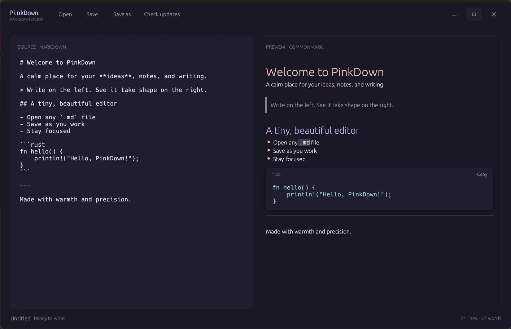

# PinkDown

PinkDown is a focused, native Markdown editor and reader built in Rust. It pairs a calm Rosé Pine interface with an editable source pane and a live rendered preview—no browser, account, or workspace setup required.



## Highlights

- Side-by-side Markdown source and rendered preview
- Open, save, and save-as support for `.md`, `.markdown`, `.mdx`, and `.txt` files
- Clear unsaved-change indicator and familiar `Ctrl/Cmd + O` / `Ctrl/Cmd + S` shortcuts
- Markdown rendering for headings, emphasis, links, inline and fenced code, lists, task items, block quotes, dividers, and tables
- UTF-8 and UTF-16 file decoding with encoding feedback in the status bar
- Native, resizable Windows window with drag-and-drop file opening
- GitHub-based update check and install for Windows x64 releases

## Using PinkDown

1. Launch the application and write in the left pane; the preview on the right updates as you type.
2. Select **Open** or drag a Markdown file into the window to edit an existing document.
3. Select **Save** to write changes to the current file, or **Save as** to choose a new location.
4. Use **Check updates** to compare the installed version against the latest GitHub tag. If a newer Windows release is available, PinkDown downloads the installer, verifies its published SHA-256 checksum, and runs it after PinkDown closes.

The Windows installer installs PinkDown for the current user and associates `.md` files with PinkDown, so Markdown documents can be opened by double-clicking them.

## Downloads and updates

Official builds are published on the [GitHub Releases page](https://github.com/3xian/PinkDown/releases). Windows is distributed as `pinkdown-windows-x64-setup.exe`; macOS releases remain standalone binaries. Every download includes a SHA-256 checksum file.

The in-app updater downloads and runs `pinkdown-windows-x64-setup.exe`. On macOS, release binaries can be downloaded manually from GitHub; automatic installation is intentionally limited to Windows for now.

## Run from source

Install the stable Rust toolchain, then run:

```bash
cargo run --release
```

## Build release binaries

```bash
# Windows x64
cargo build --release --target x86_64-pc-windows-msvc

# Apple Silicon macOS (run on macOS with the target installed)
rustup target add aarch64-apple-darwin
cargo build --release --target aarch64-apple-darwin

# Intel macOS
rustup target add x86_64-apple-darwin
cargo build --release --target x86_64-apple-darwin
```

Compiled binaries are written to `target/<target>/release/`.

## Publishing a release

The release workflow runs whenever a semantic-version tag is pushed. It builds the Windows x64 installer plus macOS Apple Silicon and Intel binaries, creates a GitHub Release, and attaches every artifact with a SHA-256 checksum sidecar.

```bash
git tag v1.0.0
git push origin v1.0.0
```

The Windows artifact must retain the name `pinkdown-windows-x64-setup.exe`, since that is the asset verified and installed by the in-app updater.

## License

MIT
